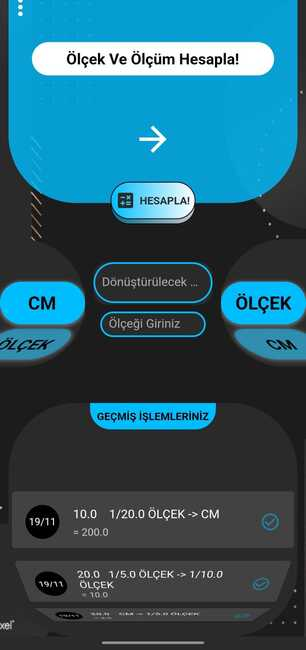

# ***Ölçek & Ölçü Hesaplama***

  
<b> Bu uygulama mimarlar ve ölçüler ile uğraşan herkes için büyük kolaylık ve hız kazandıran bir ölçü hesaplama uygulamasıdır!</b>
  
 

-> Ana sayfadan dönüşüm yapacağınız türleri belirleyip ölçü ve ölçekleri verip hesapla butonuyla hesaplamanızı yapabilirsiniz. 
-> Geçmiş hesaplamalarınızı tekrar kullanma veya ihtiyaç duyma ihtimalinizi de göz önünde bulunduran bu uygulama, geçmiş 30 işleminizi kaydeder ve görüntüleyebilmenizi sağlar. Silmek istediğiniz geçmiş hesaplamanızı kaydırarak silebilirsiniz. 
-> Ayrıca menü kısmından kendi zevkinize göre tasarım rengi seçip göz zevkinize uygun şekilde kullanabilirsiniz!!

  

<h3>!!! UYGULAMA ÖZELLİKLERİ !!!</h3>
* Ölçüyü başka bir ölçeğe çevirme  (mm,cm,m,km yi 1/5 ölçeğe çevirmek gibi) 
* Ölçeği başka bir ölçeğe çevirme  (1/7 ölçeği, 1/5 ölçeğe çevirmek gibi) 
* Ölçeği başka bir ölçüye çevirme  (1/5 ölçeği mm,cm,m,km ye çevirmek yani 5/5 gibi) 
* Ölçüyü başka bir ölçüye çevirme  (mm,cm,m,km arasında dönüşümler gibi) 

  
 

      
      

